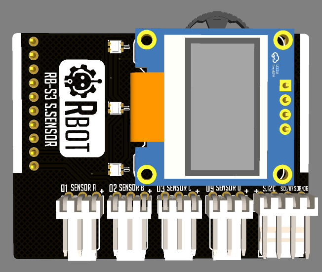

# 🧩 Plataforma-educativa-modular-ESP32-S3-S.SENSOR

## Shield de sensores e interfaz tipo HMI para proyectos educativos

La **S.SENSOR** es una *shield funcional* que forma parte de la **Plataforma Educativa Modular basada en ESP32-S3**, orientada a la implementación de **proyectos educativos en sistemas embebidos**.

Esta shield imita las funciones básicas de un **HMI (Human Machine Interface)**, enfocándose en:

- Recolección de datos desde sensores  
- Visualización de información  
- Interfaz de usuario mediante menús y botones  
- Alertas visuales y sonoras  

Se conecta a la **placa base ESP32-S3** (repositorio independiente) mediante **pin headers** y está diseñada para trabajar en conjunto con **otros shields**, permitiendo ampliar las capacidades del sistema de forma **modular y escalable**.

